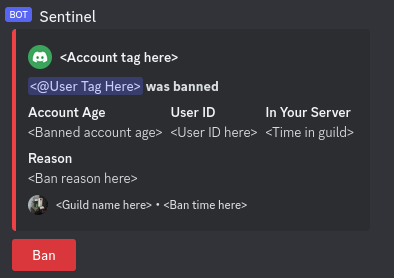

# Sentinel

Sentinel is a Discord bot that shares bans between servers.

When a user is banned in another server, Sentinel will post an alert like this to your configured alert channel:

Clicking the "Ban" button will ban the user in your server too.

## How do I broadcast a ban?

Bans are **not** broadcasted when:
- You click the "Ban" button on a Sentinel alert.
- You load a Sentinel ban list using `/import-bans`.
- Sentinel loads your server's ban list when it first joins.
- You have disabled broadcasts with `/config broadcast enabled=False`
- The ban reason text begins with "Sentinel".

If a user is banned any other way, then the ban is automatically broadcasted.

## Can I avoid broadcasting a ban?

[Disable ban broadcasting](#commands), do the ban, then re-enable broadcasting.

## Can I avoid getting alerts from some servers?

Not right now. Currently Sentinel is in private preview, so every server it's in is considered one "group". This may change in the future.

## Can Sentinel auto-ban reported users?

No. Bans cut people off from a community, and should only be used when all else has failed. Final approval on a ban should always require a human. Sentinel is a moderation tool, not a moderation replacement.

# Setup

1. <h3>Set an alert channel</h3>

    By default, Sentinel will post alerts to your server's system alerts channel, if it has one. If not, the alert channel remains unset. Bans must be manually approved by a moderator, so you may want to give Sentinel its own channel. See [Commands](#commands) to change this.

    **You will not receive ban alerts until you set an alert channel!**
2. <h3>Set bot permissions</h3>

    Sentinel requires the "Ban Members" and "Send Messages" permissions to work properly. The "Sentinel" role also needs to be ordered above the users you want it to be able to ban.

# Commands

These commands can be used by anybody in your server with the "Ban Members" permission.

**Note:** Sentinel does not include a `/ban` command because Discord already has one built in. That command _can_ accept raw user IDs (even though its UI implies otherwise).

- `/config alert-channel <channel>` - Sets the channel to output ban alerts to. This defaults to your server's system alert channel, if it has one.
- `/config broadcast enabled` - Enables or disables broadcasting your server's bans to other servers. This is enabled by default.
- `/export-bans [reason filter]` - Exports the server's bans to a JSON file. An optional filter can also be specified to only export bans whose reason matches the filter. This filter supports Regex.
- `/import-bans` - Imports a JSON ban list matching the format produced by `/export bans`. This is useful for sharing existing bans between servers.
- `/info` - Prints some basic information about Sentinel.

# License
Copyright 2023 [Mimickal](https://github.com/Mimickal) 
This code is licensed under the [AGPL-3.0](./LICENSE.md) license. 
Basically, any modifications to this code must be made open source.
